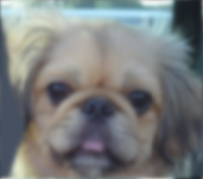
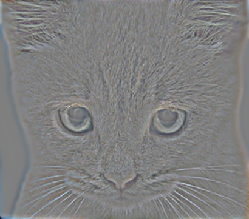

# Hybrid Images

Hybrid images demonstrate how certain frequencies dominate at certain distances. Most notably, high frequencies dominate when the object is close you you, while lower frequencies dominate when it is further away.

We can demonstrate the effect of hybrid images by applying a Gaussian blur to an image in order to produce a low-pass filtered equivalent.

 

For a different (but aligned) image we again Gaussian blur, but then subtract the low-pass image from the original in order to produce a high pass image.

 

These two images can then be summed together to produce a hybrid image as shown below. The image is downsampled to give the effect of moving the object closer/further away from your view point.


## Installation

This program is built up from openCV and argparse, so those packages should be installed through pip using the below command:

```
pip install -r requirements.txt
```

## Usage

```
> ./hybrid.py -h
usage: hybrid.py [-h] -i IMAGE IMAGE [-k KERNEL KERNEL] [-c CUTOFF CUTOFF]
                 [-o OUTPUT] [-v VISUAL] [-f] [-s]

optional arguments:
  -h, --help            show this help message and exit
  -i IMAGE IMAGE, --image IMAGE IMAGE
                        Path to input images.
  -k KERNEL KERNEL, --kernel KERNEL KERNEL
                        Kernal size, e.g. 5 7. Note: first image in list will
                        be used.
  -c CUTOFF CUTOFF, --cutoff CUTOFF CUTOFF
                        Gaussian cutoff frequencies, e.g. 5 5.
  -o OUTPUT, --output OUTPUT
                        Path to output image file.
  -v VISUAL, --visual VISUAL
                        Path to output visualisation file.
  -f, --fourier         Use Fourier convolution.
  -s, --sobel           Run Sobel edge detection on the first image.
```
